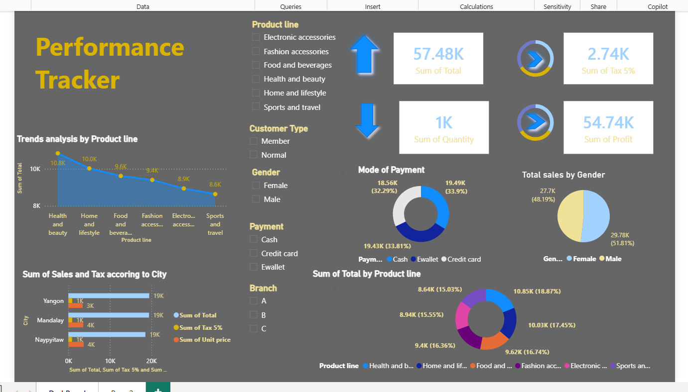

# 📊 Sales & Performance Tracker Dashboard

An interactive and dynamic Power BI dashboard designed to analyze retail sales performance, product trends, customer demographics, and regional breakdown.

---

## 📸 Dashboard Preview



---

## 🔑 Key Insights & Metrics

* **Core KPIs:** 
  * **Total Revenue:** 57.48K
  * **Total Quantity Sold:** 1K units
  * **Total Profit:** 54.74K
  * **Tax Amount:** 2.74K
* **Product Performance:** Analyzes revenue distribution across categories including *Health & Beauty*, *Home & Lifestyle*, *Food & Beverages*, *Fashion Accessories*, and *Electronic Accessories*.
* **Customer & Demographics:** Breakdown of total sales by **Gender** (Female ~51.81%, Male ~48.19%) and customer type (Member vs. Normal).
* **Payment Mode Split:** Visualizes revenue share across Cash, Credit Card, and Ewallet payment options.
* **Geographic Analysis:** Tracks sales, unit prices, and tax comparisons across cities (*Yangon*, *Mandalay*, *Naypyitaw*) and branches (*A*, *B*, *C*).

---

## 🛠️ Tools & Technologies Used

* **Business Intelligence / Visualization:** Microsoft Power BI Desktop
* **Data Processing:** Power Query (Data cleaning & transformation)
* **Data Analysis:** DAX (Data Analysis Expressions) for measures & calculations

---

## 📂 Repository Structure

```text
├── sales_dataset.xlsx        # Source dataset used for analysis     
├── dashboard_preview.png         # High-resolution dashboard image
└── README.md                     # Documentation
